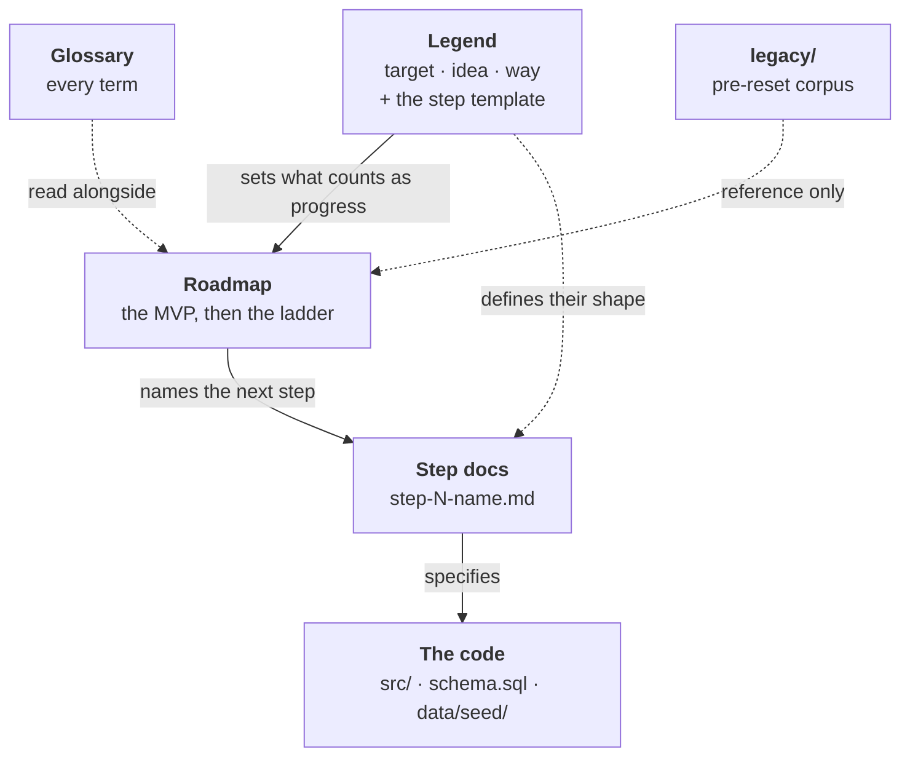

# FortuneTeller documentation

**Start here.** This is the single entry point: what the project is, which document answers which
question, and how they fit together.

> Given an event, say which instruments move, by how much, in which direction — with confidence that
> means something, in time to act on it. A warning product, not a trading system.

## The chain

The documents are one argument, narrowing from *why* to *what exactly*. Each answers the question
the one before it raises, so read them in this order the first time.

**1. Why does this project exist, and why could it work?** → **[Legend](legend.md)**
The target, the bet being made, and the principles that follow from it. It states the idea so that
it can *fail*: three things must be true, and each is tested by a specific part of the plan.

**2. So what do we build, in what order?** → **[Roadmap](roadmap.md)**
The MVP — four steps that test the first two of those three things — then a feature ladder. Each
step ends in a runnable command that prints a real number. "No edge" is a permitted answer.

**3. So what exactly are we doing right now?** → **[Step 1 — Releases](step-1-releases.md)**
One document per step: its goal, the obstacle in the way, the sequence, how you know the result is
right, and the implementation detail. The shape of these documents is fixed by the Legend.

**Where are we, and what's next?** → **[Status](status.md)**
The last completed task and the next one, kept current as work lands.

**What is in the database?** → **[Schema](schema.md)**
Every table and column: what it means, who fills it, and whether anything fills it yet.

**4. What does this word mean?** → **[Glossary](glossary.md)**
Every acronym, ticker, and piece of jargon. Read it alongside any of the above, not before them.

Off to the side: **[legacy/](legacy/README.md)** — everything written before the 2026-09-11 rewrite.
Reference material, **not instructions**. Where it and the documents above disagree, the above win.
Its one live exception is [`legacy/data/`](legacy/data/README.md), which still describes the seed
CSVs the code loads today.

## The map

Read it top to bottom: each document constrains the one below it. The Legend fixes what counts as
progress, the Roadmap turns that into an order, a step document turns one entry of that order into
something implementable, and the code is the result. The Glossary and `legacy/` are consulted from
anywhere and drive nothing.

## Find what you need

| If you want to… | Read |
| --- | --- |
| Understand the point of the project | [Legend](legend.md) — the target and the idea |
| Know why the plan is ordered this way | [Legend](legend.md) — the way, and the three conditions |
| See what gets built and when | [Roadmap](roadmap.md) |
| Start working on the current step | [Step 1 — Releases](step-1-releases.md) |
| Write the document for a new step | [Legend](legend.md) — what every step document must say |
| Look up a term or ticker | [Glossary](glossary.md) |
| Know which external services and keys are needed | [Accounts](accounts.md) |
| Know what a table or column means | [Schema](schema.md) |
| Know what the reference CSVs contain | [legacy/data/](legacy/data/README.md) — still accurate |
| Understand what was abandoned, and why | [legacy/](legacy/README.md) |

## Where things are

| Path | Holds |
| --- | --- |
| `docs/` | The current documents — the four in the chain above. |
| `docs/legacy/` | The pre-reset design corpus. Reference, not instructions. |
| `data/seed/` | The committed reference CSVs the code actually reads. |
| `schema.sql` | The table definitions, as plain SQL. Their meaning is in [schema.md](schema.md). |
| `src/fortuneteller/` | The package: config, models, store, seed loader, CLI. |
| [`../CLAUDE.md`](../CLAUDE.md) | Working agreements for this repo, including the reset note. |

## Current state

**M0 — the data spine — is shipped**: typed models, the DuckDB schema, the seed reference tables,
and a working `init | seed | query-demo` CLI. **[MVP step 1](step-1-releases.md) is done**:
`load-releases` fills `event_instances` with every US CPI release since 1972. **No prediction code
exists**, and `observations` is still empty.

**Next: MVP step 2** — daily prices for the five instruments and the return around each release.
[Status](status.md) always has the current task.

## How this folder grows

Flat until it needs not to be. A subfolder appears when a *second* document of the same kind exists
— not in advance. The natural next splits:

- `steps/` — one file per MVP step. Step 1 sits flat; when step 2's document arrives, both move here.
- `concepts/` — one file per idea needing more than a glossary line (surprise, abnormal return,
  calibration).
- `decisions/` — short records of choices that would otherwise be re-litigated.

Two rules, both learned the hard way: **a document is written when something real needs it**, and
**deleted when it stops being true**. `legacy/` exists because the last corpus drifted into
describing code that did not exist — which is worse than having no documentation at all.
