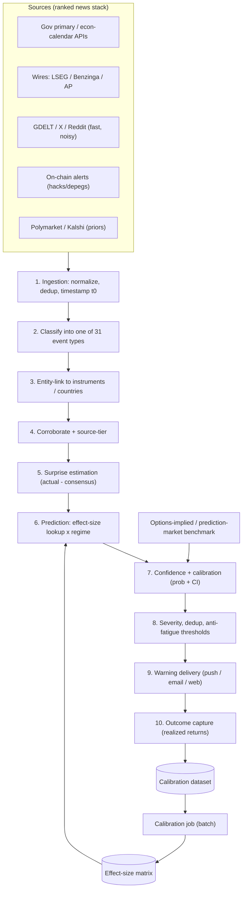

# Spec — System Architecture Sketch

> **⚠️ North-star / eventual shape — NOT the build-now plan.** This sketch is the eventual
> production system (Java / Kafka / Flink spine). Do **not** scaffold from it. What we build first is
> [mvp-architecture.md](mvp-architecture.md) (Python-first, single process, DuckDB) — that document
> wins whenever the two disagree, until a graduation trigger fires.

**Goal.** Ingest social / political / climate / macro events, predict which instruments move
(direction + magnitude + horizon) with calibrated confidence, and warn readers — within a
seconds-to-minutes budget (a warning product, not HFT, so the $$$$ co-located feeds can be
skipped).

**Design principles**

- *Calibrated, not certain* — every warning carries a probability and a magnitude range.
- *Surprise drives magnitude* — built around actual − expected, not headline tone.
- *Fast-but-noisy is confirmed before it fires* — speed tiers corroborated against reliable tiers.
- *Knowledge base is config, pipeline is code* — the Notion tables become reference data the
  services read; not in the hot path.

## 1. Data flow

The bottom loop (10 → calibration dataset → calibration job → effect-size matrix → prediction)
is what makes the system learn: realized outcomes continuously re-estimate the magnitudes and
hit-rates the predictor reads.

## 2. Stage by stage

**1 — Ingestion.** Pull/stream from ranked sources; normalize to a common envelope; assign
precise t0; dedup. Tech: Java (Spring Boot) pollers + websockets; Kafka backbone; SimHash/MinHash
dedup. Notion→runtime: News Sources DB → connector config + latency/reliability weights.

**2 — Classification.** Map each item to one of the 31 event types + polarity. Tech: LLM
classifier service (the polarity/classifier prompts) behind a queue; cheap embedding pre-router.
Notion→runtime: Events DB → label space; classifier prompts → templates.

**3 — Entity linking.** Resolve which instruments/countries are hit. Tech: Python NER
(spaCy/transformers) + gazetteer from Instruments/Countries; effect-size edges seed candidates.

**4 — Corroboration & source-tiering.** Hold low-reliability/fast signals until confirmed;
promote instantly when a primary source is the origin. Tech: Kafka Streams / Flink stateful join
over a short window.

**5 — Surprise estimation.** Scheduled → actual − consensus, then standardized surprise.
Binary/political → priced-in prior (Polymarket/Kalshi). Unscheduled → scenario. Notion→runtime:
Calibration Dataset supplies the historical stdev of surprises.

**6 — Prediction.** Look up the calibrated effect size keyed by (event_type × instrument),
conditioned on regime, scaled by standardized surprise. Baseline = event-study coefficients;
later a GBM. Tech: lookup vs effect_size_matrix from Postgres + Redis.

**7 — Confidence & calibration.** Turn raw direction-confidence + hit-rate + surprise size +
regime-fit into a probability + magnitude CI; calibrate so 70% means 70%. Benchmark vs
options-implied move and prediction-market odds.

**8 — Severity, dedup & thresholds.** severity = predicted_magnitude × confidence, mapped onto
event tiers; suppress duplicates and low-value alerts; anti-alert-fatigue rules; black-swan
regime trigger.

**9 — Warning delivery.** Render instrument, direction, size range, horizon, confidence,
triggering event, not-investment-advice disclaimer. Licensing guard: paraphrase; never
redistribute Bloomberg/Reuters/LSEG headline text — those feeds power detection only.

**10 — Outcome capture & feedback loop.** Fetch realized returns at standard horizons, write to
the Calibration Dataset, periodically re-run the calibration job. Tech: Airflow/Dagster + the
calibration SQL.

## 3. Data stores

- **Postgres** — relational spine (event_types, instruments, event_instances, effect_size_matrix).
- **TimescaleDB / ClickHouse** — prices and the observations table.
- **Redis** — hot lookups (matrix, entity dictionary) for sub-second prediction.
- **Object store (S3/GCS)** — raw ingested items for replay/audit.
- **Kafka** — the event bus + replay log for backtesting.

## 4. Cross-cutting

- **Backtesting harness** — replay historical events through stages 5–8 and score (directional
  accuracy, Brier, reliability, false-positive rate, lead time). Must beat the market-implied
  benchmark before going live.
- **Observability** — per-stage latency (guard the seconds-to-minutes budget), classifier
  accuracy, alert precision/recall, calibration drift.
- **Compliance** — not-investment-advice disclaimers; data-licensing guard (detection vs
  redistribution); audit trail of why each warning fired.

## 5. Tech stack summary

| Concern | Choice (Java-first, Python for modeling) |
| --- | --- |
| Ingestion / stream | Java (Spring Boot) + Kafka; Flink/Kafka Streams |
| Classification | LLM API behind a queue + embedding pre-router |
| Entity linking / NLP | Python (spaCy / transformers) + gazetteer |
| Modeling / calibration | Python (statsmodels, scikit-learn, later XGBoost) |
| Serving | Prediction service reading Postgres + Redis |
| Orchestration | Airflow / Dagster (batch) + streaming (realtime) |
| Storage | Postgres + TimescaleDB/ClickHouse + Redis + object store |
| Delivery | Push / email / WebSocket + templating + disclaimer layer |

> Note: this sketch describes the eventual production shape (Java/Kafka spine). The
> [Tech Stack & Reasoning](tech-stack.md) and [Roadmap](roadmap.md) deliberately start
> Python-first on DuckDB and defer the JVM/streaming machinery until throughput demands it.

## 6. Build order (MVP → full)

1. Thin vertical slice: scheduled macro only (CPI/NFP/Fed) → econ-calendar surprise → matrix
   lookup for ~5 instruments → one email/web warning. Proves the loop end-to-end.
2. Add the feedback loop (outcome capture → calibration job) so the matrix self-updates.
3. Add unscheduled detection (wires + on-chain + GDELT/X) with corroboration and the classifier.
4. Add confidence calibration + the options/prediction-market benchmark.
5. Add severity/alerting polish (dedup, anti-fatigue, tiers, black-swan trigger).
6. Harden: backtesting gate, observability, compliance.
