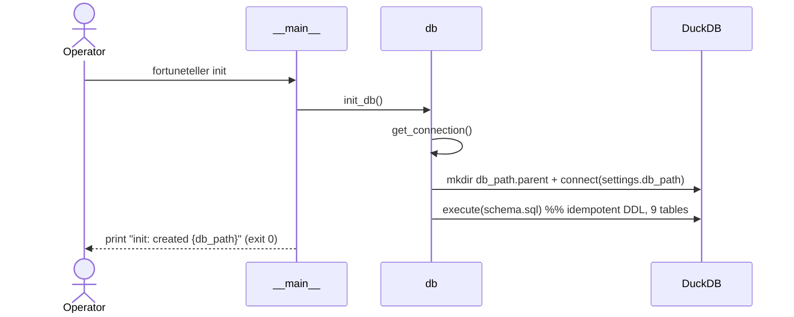
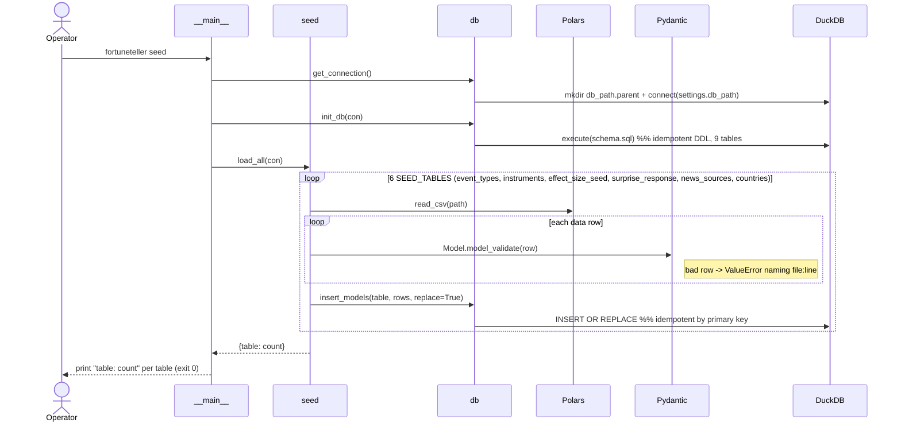
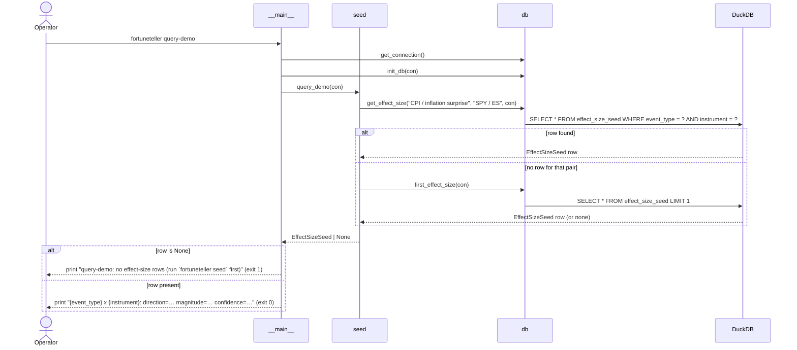
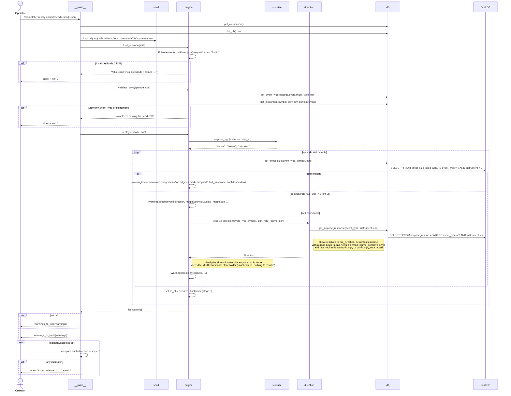
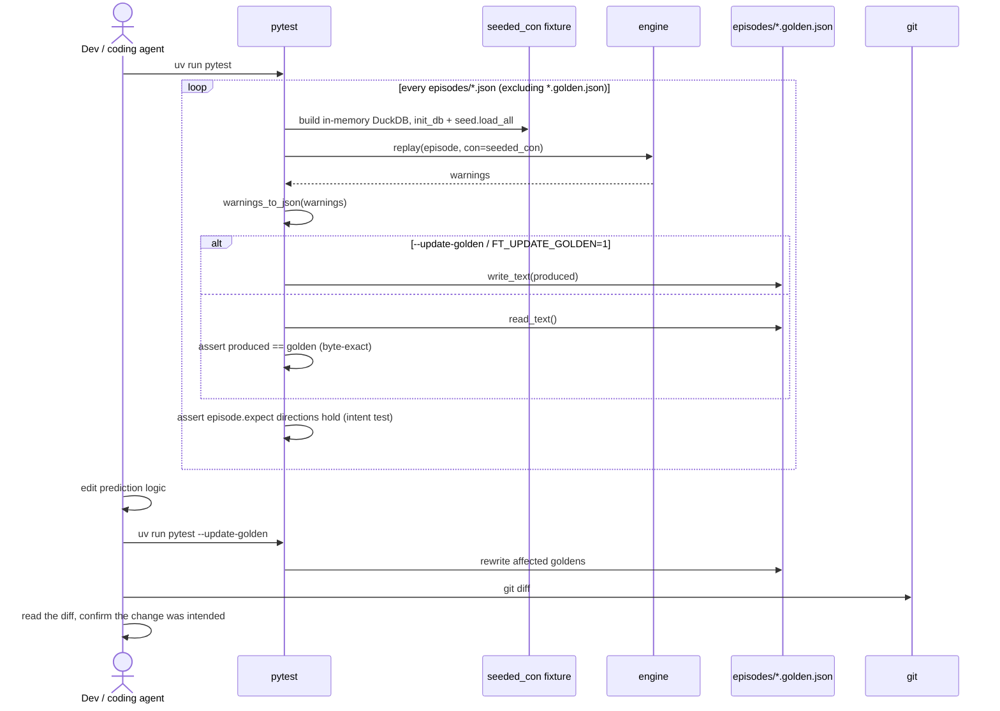
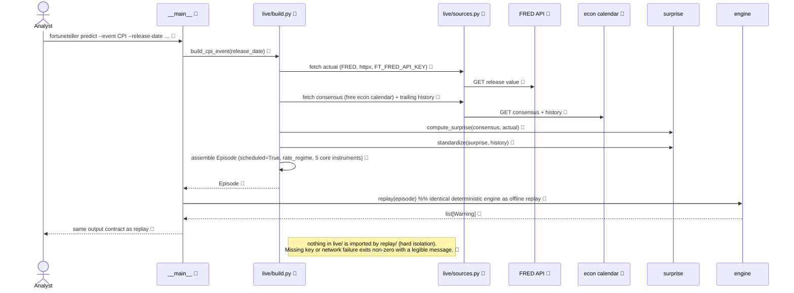
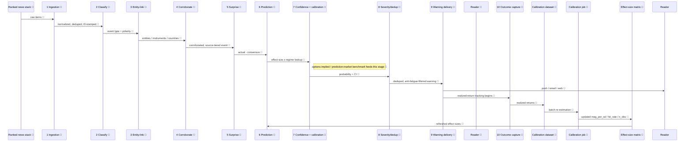

# Sequence Diagrams & Use Cases

"What happens" in FortuneTeller, call-by-call over time, complementing the prose in
[implementation-status.md](implementation-status.md) and the data-flow sketch in
[architecture.md](architecture.md).

**Status legend** (matches [implementation-status.md](implementation-status.md)): ✅ built & merged
(M0 + M0-R + M1 offline core) · 🧭 planned, not built (M1 live path, M1-06/07) · 🌟 north-star
(eventual; deliberately not scaffolded).

## Actors & use cases

| Actor | Use case (goal) | Entry point | Realized by | Status |
| --- | --- | --- | --- | --- |
| Operator | Create the local DuckDB store | `fortuneteller init` | *init* | ✅ |
| Operator | Load reference/seed data | `fortuneteller seed` | *seed* | ✅ |
| Operator | Inspect a sample effect-size edge | `fortuneteller query-demo` | *query-demo* | ✅ |
| Analyst / operator | Predict an event's market impact offline | `fortuneteller replay episodes/<id>.json` | *replay* | ✅ |
| Coding agent / dev | Change prediction logic and see exactly what moved | `uv run pytest` / `--update-golden` | *golden dev loop* | ✅ |
| Analyst | Validate the core against a real CPI release | `fortuneteller predict --event … --release-date …` | *predict (live)* | 🧭 M1-06/07 |
| Reader / subscriber | Receive a calibrated warning | delivery (stage 9) | *north-star* | 🌟 |
| Calibration job | Learn from realized outcomes, re-estimate the matrix | batch job | *north-star* feedback loop | 🌟 |

## ✅ `init`

Creates the DuckDB store and every table.

## ✅ `seed`

## ✅ `query-demo`

## ✅ `replay <episode>` — pipeline stages 5–8

The headline diagram: an already-detected event goes in, resolved `Warning`s come out, deterministically.

Determinism guarantee: `as_of` comes from `event.t0`, never `now()`; instrument order follows
`episode.instruments`; seed data is committed; there is no randomness — the same inputs always
serialize to identical bytes.

## ✅ Golden dev loop — how a coding agent changes logic safely

This is the loop CLAUDE.md calls "the spine of iteration" — offline and deterministic, no waiting
for live data.

## 🧭 `predict --event … --release-date …` — the free live path (NOT built)

Spec only, from [m1-tickets.md](m1-tickets.md)
(issues [#29](https://github.com/diykorey/fortuneteller/issues/29) /
[#30](https://github.com/diykorey/fortuneteller/issues/30), both open).

## 🌟 North-star — the 10-stage pipeline + calibration loop

Stage names taken verbatim from the flowchart in
[architecture.md](architecture.md#1-data-flow).

This is what stages 5–8 of `replay` above grow into; the MVP runs them as pure functions in one
process (mapping table in [mvp-architecture.md](mvp-architecture.md#the-core-idea)). Detection
(1–4) is M4; calibration (9–10) is M2/M3.
